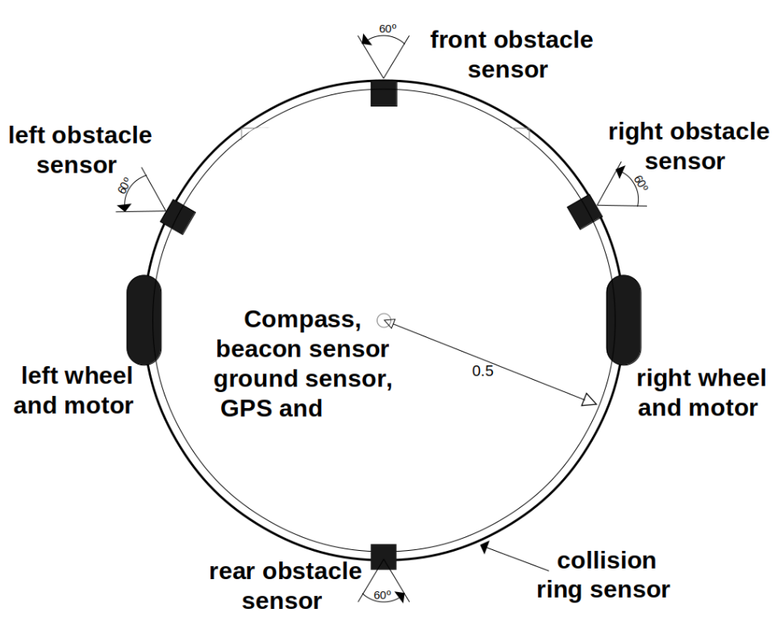

# Details about YAAVS for DAT295@Chalmers2022

## Introduction

The YAAVS system creates a virtual mine. The mine is a 2D arena populated by walls, where a starting grid, areas with gold, and an unloading area are integrated. 
The system also creates the virtual bodies of the mining vehicles. 
Participants must provide the software agents which control the movement of the mining vehicles, in order to accomplish a task.

All virtual mining vehicles have the same kind of body. 
It is composed of a circular base, equipped with sensors and actuators. 
The simulator:
* sends sensor measures to the agents, 
* receives and applies actuating orders from the agents. 

A fleet of five mining vehicles is given the following challenge: 
* starting from their position in the starting grid they must find specific spots in the mine (*loading areas*);
* reach a loading area and collect gold;
* go to the *unloading area* to deliver the collected gold;
* repeat the procedure as many times as possible in a given time.

Each vehicle has to be controlled by an independent program, i.e., the fleet is actually a collection of, possibly identical, programs. 
Vehicles are allowed to communicate with each other within given restrictions. 
Score depends on fulfilment of challenge goals and on suffered penalties.


## Simulation environment

The YAAVS software is based on a distributed architecture, where three different type of applications enter into play: the simulator, the visualizer, and the agents.


The **simulator** is responsible for:

- Implementing the virtual bodies of the robots.
- Estimating sensor measurements and sending them to the corresponding agent.
- Moving robots within the arena, according to orders received from corresponding agent and taking into account environment restrictions. For instance, a robot can not move over an obstacle.
- Routing the messages sent by robots, taking into account communication constraints.
- Updating robot score, taking into account the fulfilled goals and applied penalties.
- Sending scores and robots positions to the visualizer.
- Making available a control panel to start/restart and stop the competition.

The **visualizer** is responsible for:

- Graphically showing robots in competition arena, including their states and scores.
- Making available a control panel to start/restart and stop the competition.

The simulation system is discrete and time-driven. 
In each time step the simulator sends sensor measurements to agents, receives actuating orders, applies them, and updates scores. 
The cycle time `time_unit` is a parameter, with a default value of 50 ms.
All time intervals are measured as multiples of the cycle time.

All elements into play, namely arena, obstacles, and robots, are virtual, thus there is no need for a real length unit.
Hence, we use `d` as the unit of length, which corresponds to vehicles'
diameter.

## Vehicles

All vehicles are two-wheeled, have a circular shape and are equipped with sensors and actuators.
Moreover, vehicles can communicate.



### Sensors

Each vehicle is equipped with: 4 obstacle sensors, a collision sensor (a.k.a. *bumper*), a compass, a GPS, a ground sensor, and a beacon sensor.

Sensor models try to represent real devices.
Thus, on one side, their measures are noisy. 
On the other side, the reading of sensors is affected latency.
The amount of noise and latency is configurable for each sensor.
A latency of *N* means that the measurement available to the agent is *N* time units old.

A description for each kind of sensor follows.

#### Obstacle sensors 
They measure distances between the robot and its surrounding obstacles, including other robots. 
They can be put in any place in the robot periphery.  
Each sensor has a 60° aperture angle. 
The measure is inversely proportional to the lowest distance to the detected obstacles, and ranges between 0.0 e 100.0, with a resolution of 0.1. 

#### Bumper
It corresponds to a ring put around the robot.
It acts as a boolean variable enabled whenever there is a collision.
No noise is applied to this sensor.

#### Compass
It is positioned in the center of the robot and measures its angular position with respect to the virtual North. 
We assume the X-axis is facing the virtual north. 
Its measures range from −180 to +180 degrees, with a 1 degree resolution. 

#### GPS
It is a device that returns the position of the robot in the arena, with resolution 0.1. 
It is located at the robot center. 
When the simulation starts, the arena is randomly positioned in the world, being the origin coordinates (the left, bottom corner) assigned a pair of values in the range 0–1000. 

#### Ground sensor
It is a device that detects if the robot is completely over the target area or the home area. 
It is a boolean measure and no noise is applied to this sensor.

#### Beacon sensor
It is positioned in the center of the robot, and has an omnidirectional covering.
It measures the angular position of the beacon with respect to the robot’s frontal axis.
The measure ranges from −180 to +180 degrees, with a resolution of 1 degree.
A beacon is not detected by the beacon sensor, if
- there is a high obstacle between it and the sensor (we say the robot is in a shadow area);
- the distance from it to the sensor is higher than 5 units of lenght (robot diameters).

### Actuators

The virtual robot has two motors and three signalling LEDs. 

#### Motors
The motors try to represent, although roughly, real motors. 
Thus, they have inertia and noise. 
The 2 motors drive two wheels, placed as shown in the figure above.
Robot movement depends on the power applied to the two motors. 
Both translational and rotational movements are possible. 
If the same power values are applied to both motors the robot moves along its frontal axis. 
If the power values are symmetric the robot rotates.

The power accepted by motors ranges between −0.15 e +0.15, with resolution 0.001. 
However, this is not the power applied to wheels because of inertia and noise. 
See [*Movement model section* ](#movement-model)for a description of the input/output power relationship, that is, the relationship between power requested by agents and power applied to wheels. 

A power order applied to a motor keeps in effect until a new order is given.
In other words, if an agent applies a given power to a motor at a given time step, that power will be continuously applied in the following time steps until a new power order is sent by the agent.


#### LEDs
The 3 LEDs are named:
- *visiting led*, 
- *returning led*, and
- *end led*.

They are used to notify the simulator of a change in the robot status (e.g., if it is loaded with gold). 
The way they must be used depends on the competition challenge.


### Communication

Vehicles are equipped with a broadcast communication system. 

A vehicle can broadcast a message to all other vehicles. But there are constraints:
- Each vehicle can broadcast a single message (max 100 bytes) per time cycle, and receive up to one full message from each other vehicle. 
- A message is received by a vehicle only if the distance from the sender to the receiver is less than 8 distance units. Obstacles do not interfere with communication. 
- There is a latency of 1 cycle for every communicated message. 
- A fully linked configuration is not guaranteed at start. This means that, when the robots are in the starting grid positions, is not guaranteed that a message from a robot can be routed to all the others. 
- All communications between robots must be performed through the simulator by sending appropriate commands. Direct communication between agents, although technically possible, is considered cheating.


## Movement model

Vehicle’s position is given by `(x, y, θ)`, where `x` and `y` define the location of the center of the vehicle, and `θ` specifies its orientation. 

The following algorithm determines the new position of the vehicle at the following time step, given the input `(in_left, in_right)` that corresponds to the command sent by the agent to the simulator for wheels' motors.

The effective power that is applied to the motor takes into account inertia and noise, and it is derived as follows for the left wheel:
```text
noise = Norm(1, σ²)
speed_left = (in_left + prev_speed_left) * noise / 2
```
where noise is a random value generated form a Gaussian distribution with mean 1 and variance `σ²`, and  `prev_speed_left` is the previous value of `speed_left`.
The same is applied to the right wheel, independently.

Then, the movement is split in a translation of the vehicle position, considering its current
orientation, followed by a change of the orientation of the vehicle. 
For the translation one has
```text
lin = (speed_right + speed_left) / 2
x += lin * cos(θ)
y += lin * sin(θ)
```
and for the rotation
```text
θ += (speed_right - speed_left ) / d 
```
where `d` is the vehicle's diameter. 

Note that this provides the new vehicle position `(x , y , θ)` at the next step, **if no collisions occur**. 
In case of a collision, the simulator applies the rotational component only.


## Arena

The arena represents a mine.

The arena is composed of a rectangular arena, outer delimited, with obstacles, target (*loading*) areas, a home (*unloading*) area and a starting grid inside.

Obstacles are fixed elements placed within the arena to limit the robot movements.
The target areas are circular with a beacon in its center. 
The starting grid defines the robots initial positions. 
The home area is a circle, without a beacon in its center, centered in grid position number 1. 

Target areas are where mining vehicles collect gold (loading); the home area is where mining vehicles deliver gold (unloading).

The following rules are observed:

**Arena**
1. The arena maximum dimension is 14x28.

**Obstacles**
2. All obstacles have planar surfaces, at least 0.3 um wide.
3. Any passage between obstacles is at least 1.5 um wide.

**Home area (unloading)**
4. The home area radius is at least 2.0 um wide.
5. The home area is centered in starting position number 1.

**Target areas (loading)**
6. The target area radius is at least 2.0 um wide.
7. There is a beacon in the center of each target area.
8. The beacon does not act as an obstacle to robot movement.
9. The beacon range is equal to its target area radius.


## Tasks

The overall goal is to develop the AI of autonomous vehicles, such that they move as much gold as possible from the target positions to the unloading area in different (possible unknown) mines.

More specific and detailed tasks have to be defined in your project proposal.
